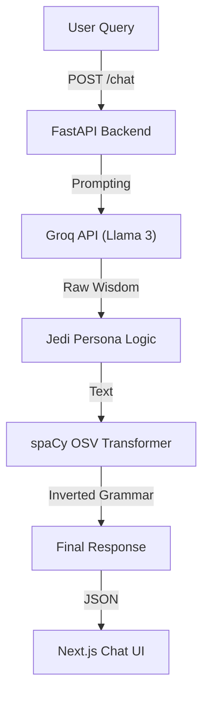

# Jedi-inspired Wise Chatbot

A production-ready, full-stack chatbot that speaks in the style of a wise Jedi mentor using natural language style transfer.

> **Disclaimer**: This is a Jedi-inspired wise chatbot. Not affiliated with Star Wars, Disney, or Lucasfilm.

## 🧠 Architecture

The system uses a strict pipeline to ensure character consistency and grammatical style:



## 🛠 Tech Stack

- **Backend**: FastAPI, LangChain, spaCy, Python 3.10+
- **LLM**: Groq API (Llama3-70b-8192)
- **Frontend**: Next.js (React), TailwindCSS, Lucide Icons
- **Key Libraris**: `pydantic`, `python-dotenv`, `spacy`

## 🚀 Setup Instructions

### Prerequisites
- Python 3.10+
- Node.js 18+
- Groq API Key (Free tier)

### 1. Backend Setup

1.	Navigate to the backend directory:
    ```bash
    cd backend
    ```
2.	Install dependencies:
    ```bash
    pip install -r requirements.txt
    ```
3.	Download the spaCy model:
    ```bash
    python -m spacy download en_core_web_sm
    ```
4.	Configure Environment:
    - Copy `.env.example` to `.env`
    - Add your **GROQ_API_KEY**
    ```bash
    cp .env.example .env
    # Edit .env and paste your key
    ```
5.	Start the Server:
    ```bash
    uvicorn main:app --reload
    ```
    The API will run at `http://localhost:8000`.

### 2. Frontend Setup

1.	Navigate to the frontend directory:
    ```bash
    cd ../frontend
    ```
2.	Install dependencies (if not already done):
    ```bash
    npm install
    ```
3.	Start the Development Server:
    ```bash
    npm run dev
    ```
4.	Open `http://localhost:3000` in your browser.

## 🧪 Verification & Features

- **Jedi Persona**: The system uses a specialized system prompt to maintain a wise, philosophical tone.
- **Grammar Inversion**: A custom spaCy module (`yoda_transform.py`) attempts to invert sentences to Object-Subject-Verb (OSV) order strictly (e.g., "You must have patience" -> "Patience, you must have.").
- **IP Safety**: Explicitly avoids "Yoda" or "Star Wars" terms in prompts and UI.
- **Safety**: Disclaimer clearly visible in the UI header.

## 📂 Project Structure

```
jedi-chatbot/
├── backend/
│   ├── main.py          # FastAPI Entry Point
│   ├── llm.py           # LangChain + Groq Logic
│   ├── yoda_transform.py # spaCy Grammar Enforcer
│   ├── prompts.py       # Persona Definitions
│   └── schemas.py       # Pydantic Models
├── frontend/
│   ├── app/
│   │   ├── components/  # ChatInterface, MessageBubble
│   │   ├── page.tsx     # Main Page
│   │   └── globals.css  # Custom CSS & Animations
│   └── package.json
└── README.md
```

## ⚠️ Troubleshooting

- **"Disturbance in the Force" (Network Error)**: Ensure the backend is running on port 8000.
- **Authentication Error**: Check your `GROQ_API_KEY` in `backend/.env`.
